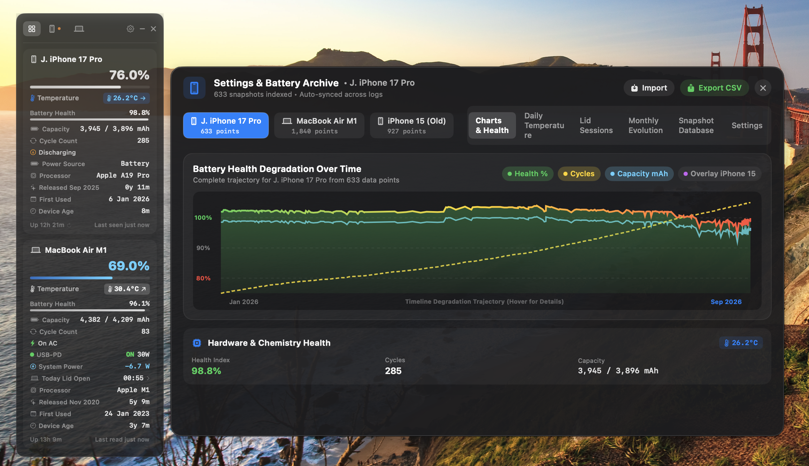
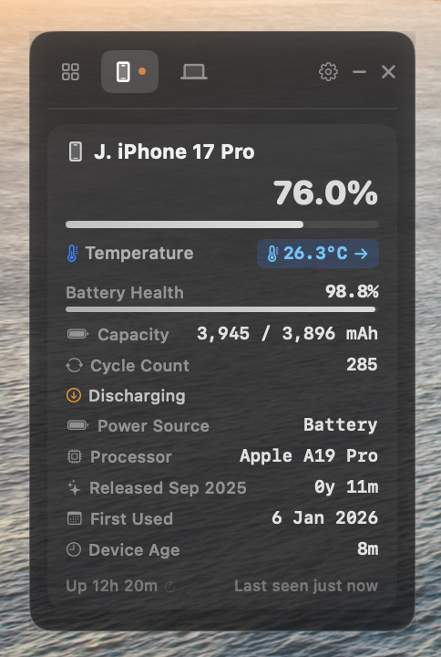

# iPhone Battery Widget (macOS)

A lightweight, translucent floating macOS desktop widget and comprehensive battery dashboard for MacBooks, iPhones, and iPads.

[](https://github.com/LondonVista/iPhoneBatteryWidget/releases)
[](https://github.com/LondonVista/iPhoneBatteryWidget/releases/latest)
[](https://github.com/LondonVista/iPhoneBatteryWidget/releases/latest)
[](https://github.com/LondonVista/iPhoneBatteryWidget)
[](https://timber-gem-fjord-cobalt.grok.me)

<p align="center">
  
</p>

<p align="center">
  
</p>

---

## ✨ Features

- **Live Multi-Device Battery Tracking**: Real-time battery levels, charging state, wattages, amperage, voltage, and accurate cycle counts for both your Mac and connected iPhones/iPads.
- **Hardware NTC Thermistor Readings**: Live temperature monitoring directly from internal sensors with thermal gradient indicators and alert thresholds.
- **Dual Connection Engine**: Native `usbmuxd` lockdown communication prioritizing direct USB high-speed connection with seamless Wi-Fi sync fallback.
- **Lid Session & Screen Tracker**: Automatic tracking of MacBook lid open/close times, work sessions, and screen-on durations.
- **Battery Health Degradation Curves**: Historical analytics, degradation trend curves, and 24-hour temperature charts.
- **Smart Audio Cues & Charging Alerts**: Stereo panned USB-PD handshake audio chime, cable connection alerts, and 80% charge notifications.
- **Glassmorphic Floating UI**: Always-on-top translucent dark glass widget designed to blend seamlessly into macOS.

---

## 🚀 Quick Start & Build

### Prerequisites
- macOS 13.0 (Ventura) or later (Apple Silicon)
- Xcode Command Line Tools (`xcode-select --install`)

### Build & Run
To compile and automatically install to `/Applications`:

```bash
chmod +x build.sh
./build.sh
```

For an optimized release build:
```bash
./build.sh --release
```

---

## 🛠️ LaunchAgent Auto-Start (Optional)
To have the widget automatically start on login:

```bash
cp com.londonvista.iphone-battery-widget.plist ~/Library/LaunchAgents/
launchctl load ~/Library/LaunchAgents/com.londonvista.iphone-battery-widget.plist
```

---

## 📄 License
MIT License
